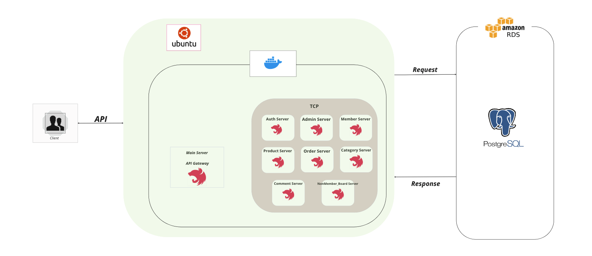

# MSA-SHOP

## BackEnd - 심재두

### 아키텍쳐 구조



### Shop ERD 설계


---

## #프로젝트 소개
- MicroService를 사용하여 각각의 서버를 관리합니다.
- 모노레포를 통해 app으로 관리를 하며, 공통적으로 사용하는 라이브러리들은 libs 폴더로 사용을 합니다.
- 쇼핑몰 프로젝트이며, 회원과 관리자가 있고 회원에는 일반회원, 우수회원이 있으며 관리자에는 판매관리자,운영관리자로 이루어져 있습니다.
- 현재 멤버가드쪽에는 회원 / 비회원 / 통합멤버가드 로 나누어져있고, 관리자가드쪽에는 판매자권한가드 / 운영자권한가드로 되어있습니다.
- 서비스마다 권한에 맞는 서비스를 이용할 수 있고, 해당 상품에 대한 댓글로 문의사항을 남길 수 있습니다.
- 비회원의 경우에는 주문을 요청할 시 보안코드가 발급되며, 보안코드를 통해 서비스를 이용할 수 있습니다. 상품문의등은 비회원전용 게시판을 통해 질의응답이 이루어집니다.


### 사용기술

- TypeScript
- NestJs
- Prisma
- MicroService
- PostgreSQL
- Docker


### Main Server Use

```bash
npm run start:main
```


### Module Server Use
```bash
npm run start:admin
npm run start:auth
npm run start:category
npm run start:comment
npm run start:member
npm run start:nonmember_board
npm run start:order
npm run start:product
```

### Install
```angular2html
npm i | npm install
```

### Docker PostgreServer Port
```angular2html
5432:5432
```